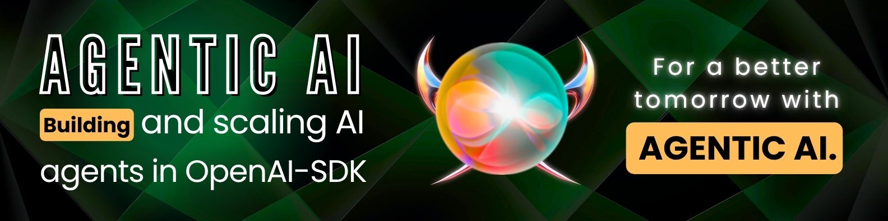

# 🤖 Agentic AI – OpenAI_SDK

> **Program:** Agentic AI – OpenAI_SDK  
> **Organization:** GIAIC – Governor House (Onsite)  
> **Focus:** Building intelligent autonomous agents using OpenAI tools and SDKs  

---

## 📚 Resources

- 📘 [OpenAI SDK Documentation](https://openai.github.io/openai-agents-python/running_agents/)
- 🔗 [Chainlit Documentation](https://docs.chainlit.io/get-started/overview)

---

## 👨‍🏫 Teachers

- **Sir Bilal Khan**  
- **Sir Bilal Fareed**

---

## 🧠 Technologies Used

- Python 3.12  
- OpenAI Agents SDK  
- Chainlit (for chat UI)  

---

